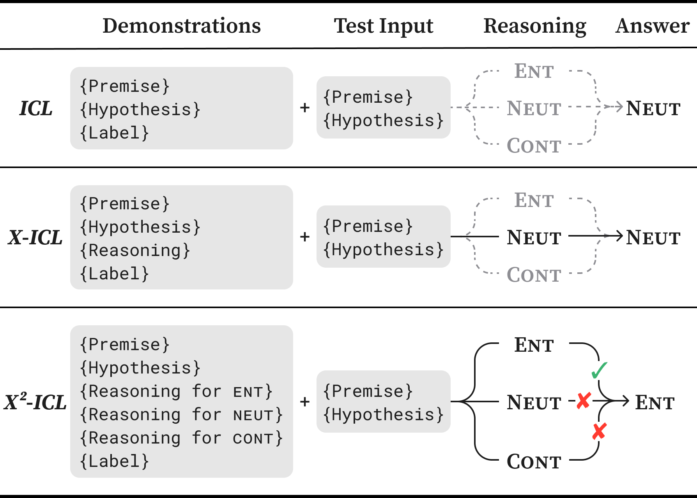

# Exploring Explanations Improves the Robustness of In-Context Learning

This repository implements the main experiments of our ACL 2025 paper, [Exploring Explanations Improves the Robustness of In-Context Learning](https://aclanthology.org/2025.acl-long.1155/).
In our paper, we introduce an advanced ICL framework, **X^2-ICL**, which systematically **explores explanations** for all possible labels during inference.
This approach enables more comprehensive and robust decision-making, especially when faced with out-of-distribution data.



The code is intended solely for reproducing the experiments.
It is based on the [X-ICL](https://github.com/xlhex/acl2024_xicl) repository, and we gratefully acknowledge the authors of that work.


## Environment

We tested the code in the following environment.

* OS: Ubuntu 22.04.3 LTS
* Python: 3.12
* CUDA: 12.2
* GPU: NVIDIA A100 (40GB)


## Setup

### Python and Packages

We used [uv](https://github.com/astral-sh/uv) to manage Python and its packages.
```bash
git clone https://github.com/CyberAgentAILab/x2-icl.git
cd x2-icl

# (Optional) If this version of Python is not installed
uv python pin 3.12
uv python install

# PyTorch needs to be installed separately
uv venv --python 3.12 --python-preference managed
uv pip install --no-cache --force-reinstall -r requirements.txt
uv pip install --no-cache --force-reinstall torch==2.5.1 --index-url https://download.pytorch.org/whl/cu121
```

### API Keys

The code assumes that the API keys are stored as environment variables.
Fill in the `.envrc` file and load it.

```bash
cp .envrc_example .envrc

`Fill in the .envrc file with your API keys`

# If you are using direnv
direnv allow
# Otherwise
source .envrc
```

### Data

Download the test data from the repository of [X-ICL](https://github.com/xlhex/acl2024_xicl) and place them under `data/testset`.
```bash
git clone https://github.com/xlhex/acl2024_xicl.git
cp -r acl2024_xicl/data/testset ./data
rm -rf acl2024_xicl
```

The demonstration files in [`data/prompt`](data/prompt) are adapted from [X-ICL](https://github.com/xlhex/acl2024_xicl).
The files are named as follows:
* `xx.txt`: Demonstrations for vanilla **ICL**. `xx` corresponds to one of {`anli_v1`, `esnli_no`, `qqp_no`}.
* `xx_one_reason.txt`: Demonstrations for **X-ICL**. `_no` omitted.
* `xx_all_reason.txt`: Demonstrations for our **X^2-ICL**. `_no` omitted.


## Run

Below are sample commands for running the experiments. See [`script`](script) for more examples.  

> [!NOTE]
> * We used Azure OpenAI API for GPT-4o.
> * We used the specific version `gpt-4o-2024-08-06`, and the code assumes that the deployment name is the same.
>   - If you want to use a different deployment name, modify `model_libs` in [`code/utils_api.py`](code/utils_api.py).
> * We set the content filters to the least restrictive setting.

```bash
MODEL="gpt-4o-2024-08-06"
TASK="ANLI"
TEST="data/testset/anli_v3_hard.jsonl"
SEED=1000

# Vanilla ICL
uv run code/run_gpt.py \
  --model_name $MODEL \
  --train_file data/prompt/anli/seed$SEED/anli_v1.txt \
  --test_file $TEST \
  --task $TASK \
  --seed $SEED

# X-ICL
uv run code/run_gpt.py \
  --model_name $MODEL \
  --train_file data/prompt/anli/seed$SEED/anli_v1_one_reason.txt \
  --test_file $TEST \
  --task $TASK \
  --seed $SEED

# X^2-ICL
uv run code/run_gpt.py \
  --model_name $MODEL \
  --train_file data/prompt/anli/seed$SEED/anli_v1_all_reason.txt \
  --test_file $TEST \
  --task $TASK \
  --seed $SEED
```


## Citation

```bibtex
@inproceedings{honda-oka-2025-exploring,
    title = "Exploring Explanations Improves the Robustness of In-Context Learning",
    author = "Honda, Ukyo and Oka, Tatsushi",
    editor = "Che, Wanxiang and Nabende, Joyce and Shutova, Ekaterina and Pilehvar, Mohammad Taher",
    booktitle = "Proceedings of the 63rd Annual Meeting of the Association for Computational Linguistics (Volume 1: Long Papers)",
    month = jul,
    year = "2025",
    address = "Vienna, Austria",
    publisher = "Association for Computational Linguistics",
    url = "https://aclanthology.org/2025.acl-long.1155/",
    doi = "10.18653/v1/2025.acl-long.1155",
    pages = "23693--23714",
    ISBN = "979-8-89176-251-0",
}

@inproceedings{he-etal-2024-using,
    title = "Using Natural Language Explanations to Improve Robustness of In-context Learning",
    author = "He, Xuanli and Wu, Yuxiang and Camburu, Oana-Maria and Minervini, Pasquale and Stenetorp, Pontus",
    editor = "Ku, Lun-Wei and Martins, Andre and Srikumar, Vivek",
    booktitle = "Proceedings of the 62nd Annual Meeting of the Association for Computational Linguistics (Volume 1: Long Papers)",
    month = aug,
    year = "2024",
    address = "Bangkok, Thailand",
    publisher = "Association for Computational Linguistics",
    url = "https://aclanthology.org/2024.acl-long.728/",
    doi = "10.18653/v1/2024.acl-long.728",
    pages = "13477--13499",
}
```
